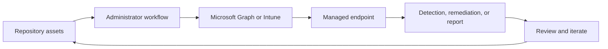

<!-- unified-readme:start -->
<div align="center">

# Intune Tool Box - Rebuild of Intune in PowerShell

**I think everyone who works with Intune on a daily basis knows the situation that they would like to have a simple feature that would simplify their daily work. In order not to have to do without exactly these small features that would make everyday life easier, I have created the Intune Tool Box. This is a WPF application that is written in PowerShell. The app has the same design as Intune but offers small helpers for the daily work. The good thing is that this app is built in such a way that it can be easily extended at any time. If you have any features in your mind that you are missing in Intune console let me know so I can add them to the app.<br/>.**

Build. Automate. Share.

[](https://github.com/JayRHa/IntuneToolbox/stargazers)
[](https://github.com/JayRHa/IntuneToolbox/network/members)
[](https://github.com/JayRHa/IntuneToolbox/issues)
[](https://github.com/JayRHa/IntuneToolbox/graphs/contributors)

[Blog Post](https://jannikreinhard.com/2022/07/07/intune-tool-box-rebuild-of-intune-in-powershell/)


<p>
  <a href="https://jannikreinhard.com/">Blog</a> ·
  <a href="https://www.linkedin.com/in/jannik-r/">LinkedIn</a> ·
  <a href="https://x.com/jannik_reinhard">X</a>
</p>

---

`Endpoint Management` | `PowerShell` | `Public` | `Archived`

</div>

## What is this?

Intune Tool Box - Rebuild of Intune in PowerShell supports Microsoft Intune and endpoint management workflows such as automation, troubleshooting, remediation, deployment, or reporting.

## Project Context

- Use it when Intune work should be scripted, packaged, synchronized, or made easier to repeat.
- Most workflows start from repository assets, then move through Microsoft Graph, Intune, or device-side execution.
- This repository is archived and kept as a reference implementation.

## How It Works

The repository stores scripts or tooling, administrators configure or run them, Intune and Microsoft Graph apply the work, and endpoint results feed back into reports or follow-up actions.



## Quick Start

1. Review the project context and workflow below.
2. Clone the repository:

   ```bash
   git clone https://github.com/JayRHa/IntuneToolbox.git
   ```

3. Continue with the setup, usage, or workflow sections below.

---
<!-- unified-readme:end -->

## How to execute the application
* Download and unzip the whole folder <br/>

* Execute the Start-IntuneToolbox.ps1
* Have fun

## Features
### Overall Environment View:
On the start page you can get an overview of your complete environment and see how many clients are enrolled per OS.<br/>


### Group View:
In this view you get an overview from all groups in your environment with all the features know from the Portal.<br/>


### Sync all devices:
Sync all devices in a group with one simple click.<br/>


### Group Overview:
I think you have often been in a situation where you wanted to see what is assigned to a group. Now you can easily see this in the overview.<br/>


### Migrate Group:
With this function you can convert a user group into a device group or a device group into a user group. For this it is checked who is the owner of the device or which devices a certain user owns.<br/>


### Duplicate Group:
Create a copy from a existing group. All member will be take over.<br/>


### Assign Items:
You can assign configuration profiles, compliance policies or apps direct in the group view.<br/>

